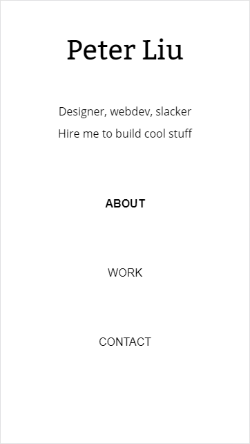
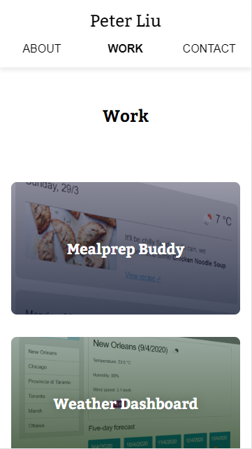
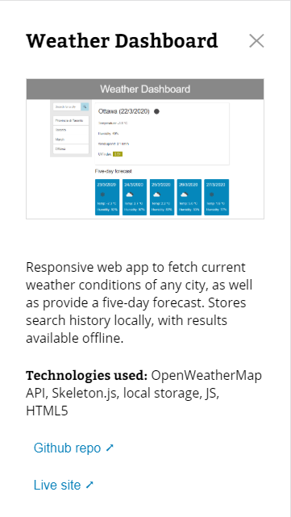
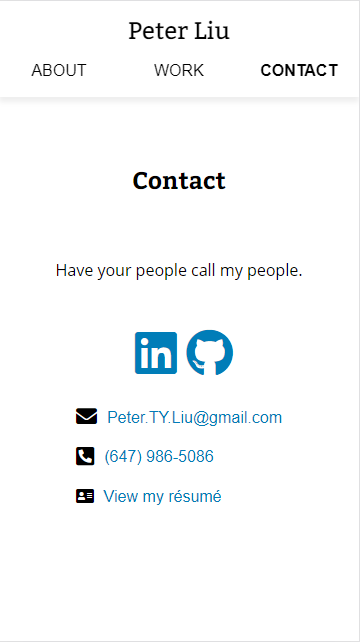

# Assignment 7: Update Portfolio

## Updated portfolio with a few class and personal projects. A simple, mobile-first responsive website.

Home screen

Scrolling down or clicking 'work' takes you to the work section, where a gallery of projects exists

Clicking a project shows a screenshot, description, summary of technologies used, and link to the repo and live site.

Scrolling down or clicking 'contact' takes you to the contact section, where personal links, contact info, and a resume can be viewed.

## Link to live site: https://petertyliu.github.io/seventh-assignment-update-portfolio/
